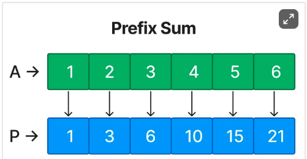

# Tools and Patterns

## Before Anything
1. Check if you can create an auxiliary container (prefix-sum)
2. Check if you can re-arrange the data (sorting) to facilitate the logic.
3. Check if you can Algebra to facilitate the logic.

## Prefix Sum



Prefix Sum involves preprocessing an array to create a new array where each element at index i represents the sum of the array from the start up to i. This allows for efficient sum queries on subarrays. Use this pattern when you need to perform multiple sum queries on a subarray or need to calculate cumulative sums.

**Sample Problem**:
Given an array nums, answer multiple queries about the sum of elements within a specific range [i, j].

Example:

```
Input: nums = [1, 2, 3, 4, 5, 6], i = 1, j = 3

Output: 9

Explanation:
Preprocess the array A to create a prefix sum array: P = [1, 3, 6, 10, 15, 21].

To find the sum between indices i and j, use the formula: P[j] - P[i-1].
```

---