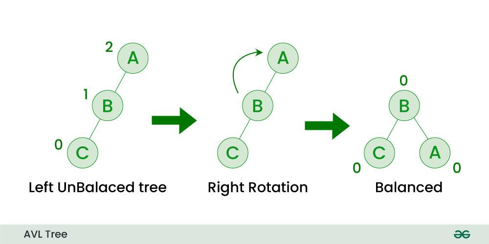

# AVL Binary Search Tree

An *AVL* tree defined as a self-balancing Binary Search Tree (BST). The difference between the
heights of the left subtree and the right subtree for any node is known as the *balance factor* of 
the node.

THe *balancing* occurs while inserting or deleting nodes from the tree.

## Balance Factor

Is the difference in heigh of the left subtree minus the heigh of the right subtree. A *BL* greater
than 1 indicates an unbalanced left subtree. Contrary a *BL* less than -1 indicates an unbalanced
right subtree.

### Left Left Rotation

Used to correct a subtree entirely stacked to to the right.


### Right Right Rotation

Used to correct a subtree entirely stacked to to the left.



### Right Left Rotation

Used to correct a subtree stacked to to the left then to the right.


## Left Right Rotation

Used to correct a subtree stacked to to the right then to the left.


## Implementation

```go
type Node struct {
    val int
    height int
    left *Node
    right *Node
}

func newNode(val int) *Node {
    return &Node{Height: 1}
}

func (n *Node) height int {
    if n == nil {
        return 0
    }

    return return n.height
}

func (n *Node) updateHeight() {
    n.height = max(height(n.left), height(n.right)) + 1
}

func max(l, r int) int {
    if l > r {
        return l
    }

    return r
}

func Insert(n *Node, val int) *Node {
    if n == nil {
        return newNode(val)
    }

    if n.left < val {
        n.left = Insert(n.left, val)
    } else {
        n.right = Insert(n.right, val)
    }

    n.updateHeight()

    return n
}

func Delete(n *Node, key int) *Node {
    if n == nil {
        return nil
    }

    if n.val < n.left {
        n.left = Delete(n.left, key)
    } else if val > n.right {
        n.right = Delete(n.right, key)
    } else {
        if n.left == nil {
            return n.right
        }

        if n.right == nil {
            return n.left
        }

        successor := getSuccessor(n)
        n.val = successor.value
        n.right = Delete(n.right, successor.value)
    }

    n.updateHeight()

    return n
}

func getSuccessor(n *Node) *Node {
    current := n.right

    for current.left != nil {
        current = current.left
    }

    return current
}

func rotateLeft(x *Node) *Node {
    y := x.right
    t2 := y.left

    y.left = x
    x.right = t2

    y.updateHeight()
    x updateHeight()

    return y
}

func rotateRight(y *Node) *Node {
    x := y.left
    t2 := x.right

    x.right = y
    y.left := t2

    x.updateHeight()
    y.updateHeight()

    return x
}

func balanceFactor(n *Node) int {
    return height(n.left) - height(n.right)
}

func balanceNode(n *Node) *NOde {
    if balanceFactor(n) > 1 {
        if balanceFactor(n.left) >= 0 {
            return rotateRight(n)
        } else {
            n.left = rotateLeft(n.left)
            return rotateRight(n.right)
        }
    }

    if balanceFactor(n) < -1 {
        if balanceFactor(n.right) <= 0 {
            return rotateLeft(n)
        } else {
            n.right = rotateRight(n.right)

            return rotateLeft(n)
        }
    }

    return n
}

func InsertAndBalance(n *Node, val int) *Node {
    n = Insert(n, val)

    return balanceNode(n)
}

func DeleteAndBalance(n *Node, key int) *Node {
    n = Delete(n, key)

    return balanceNode(n)
}

```