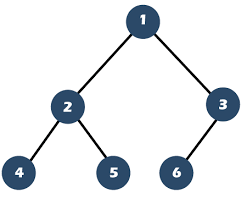

# Binary Tree
Hierarchical data structure composed of `Nodes` on which every Node can have up to 2 children Nodes
`Left` and `Right`. The top of the tree is called `Root`. 

## Pendientes
- [x] sacar la altura del arbol o nodo
- [ ] imprimir un arbol bien
- [ ] mira este [ejemplo](https://www.geeksforgeeks.org/insertion-in-an-avl-tree/)

## Binary tree use cases
- Abstract syntax tree implementation (tokenization)
- Binary heaps implementation
- Binary Tries implementation to store router-tables
- Maintain sorted a stream of data

## Binary Search Tree (BST)
A *BST* is a binary tree that satisfies the BST invariant: *left subtree has smaller elements and 
right subtree has larger elements*.


### BST base structure
```go
type Node[T any] struct {
    value T
    left *Node[T]
    right *Node[T]
}

type Tree[T] struct {
    root *Node[T]
}
```

### BST insert
```go
func(t *Tree[T]) Insert(val T) *Tree {
    if t.root == nil {
        t.root = &Node{value: val}
    } else {
        t.root.insert(val)
    }

    return t
}

// note: ignoring duplicates, depends on the use case

// base insert without any balancing
func (n *Node[T]) Insert(val T) {
    if val < n.value {
        if n.left == nil {
            n.left = &Node{value: val}
        } else {
            n.left.insert(value)
        }
    } else if n > n.value {
        if n.right == nil {
            n.right = &Node{value: val}
        } else {
            n.right.insert(value)
        }
    }
}
```

---

## Balanced Binary Tree
A height balanced binary tree is a binary tree in which the height of the left subtree and right 
subtree of any node does not differ by more than 1 and both the left and right subtree are also 
height balanced. The difference in heigh is know as balance factor.


### Balanced vs Unbalanced 
A balanced binary tree has better performance compared to the unbalanced counterpart.

| Operation | Balanced | Unbalanced |
| --------- | -------- | ---------- |
| Insert    | O(log n) | O(n)       |
| Find      | O(log n) | O(n)       |
| Delete    | O(log n  | O(n)       |

#### Balancing an Unbalance BST
1. Traverse the tree in order and save nodes in an Array
2. Take the middle of the Array as the root of the balanced tree.
3. Construct the BST using the middle element of both left and right sub-slice

```go
type within(elem int)

func inOrder(list *[]int) func(int) {
    return func(elem int) {
        *list = append(*list, elem)
    }
}

func traverse(node Node, fn within) {
    if node == nil {
        return 
    }

    traverse(node.left)

    fn(node.value)

    traverse(node.right)
}

func arrToBST(arr []int) *Node {
    if len(arr) == 0 {
        return nil
    }

    middle := len(arr) / 2
    root := &Node{value: arr[middle]}

    root.left = arrToBST(arr[:middle])
    root.right = arrToBST(arr[middle+1:])

    return root
}
```

### AVL Tree
An *AVL* tree defined as a self-balancing Binary Search Tree (BST). The difference between the 
heights of the left subtree and the right subtree for any node is known as the *balance factor* of the node.

### Red Black Tree
A Red Black Trees a self-balancing Binary Search Tree (BST) that use a set of rules to maintain balance, 
ensuring logarithmic time complexity for operations like insertion, deletion, and searching, 
regardless of the initial shape of the tree. Self-balancing, is done using a simple color-coding 
scheme to adjust the tree after each modification.

## Complete Binary Tree
A `complete binary tree` is a tree in which at every level, except possibly the last is completely 
filled and all nodes are as far left as possible.



## Full Binary Tree
A `full binary tree` is a binary tree with either zero or two child nodes for each node. 


